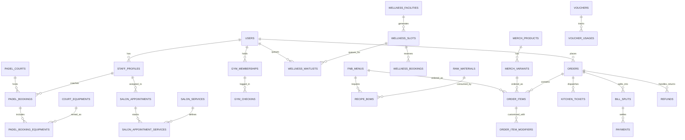

# Desain Skema Database: Club 61 PostgreSQL Architecture (Edisi Final & Bulletproof)

Dokumen ini membedah secara mendalam seluruh rancangan database **PostgreSQL 16** untuk **Club 61 Integrated Dashboard System** berdasarkan spesifikasi PRD, dilengkapi pengaman **Database-Level Invariants** lengkap untuk mencegah *race condition*, kebocoran kuota, stok minus, dan duplikasi jadwal pelatih.

---

## 1. Standar Konvensi & Tipe Data

Untuk menjamin performa tinggi, keakuratan finansial, dan integritas data anti-korup, berikut standar yang kita tetapkan:

| Kebutuhan Data | Tipe Data PostgreSQL | Alasan & Aturan Keamanan |
| :--- | :--- | :--- |
| **Primary Key (ID)** | `UUID` (`gen_random_uuid()`) | Aman dari tebakan ID di URL publik, siap untuk sinkronisasi multi-device/PWA/mobile. |
| **Nominal Uang & Harga** | `DECIMAL(12, 2)` | **Haram pakai Float**. Akurat hingga digit rupiah terkecil, anti-selisih pada kalkulasi Split Bill dan diskon voucher. |
| **Waktu & Tanggal** | `TIMESTAMPTZ` | Otomatis menyimpan zona waktu (`Asia/Jakarta` / WIB) agar jam booking tidak bergeser saat diakses perangkat berbeda. |
| **Slot Rentang Waktu** | `TSTZRANGE` + `GIST` | Menjamin secara matematis di level database bahwa 1 lapangan, 1 pelatih, atau 1 stylist tidak bisa disewa 2 orang di jam bertabrakan. |
| **Batas Kuota & Stok** | `CHECK` Constraints | Mengunci batas bawah stok $\ge 0$, kuota $\le \text{max\_capacity}$, dan pemakaian voucher $\le \text{quota}$ di level engine database. |
| **Resep / BOM & Modifier**| `JSONB` / Relational | Fleksibel menyimpan log opsi add-on pesanan (level gula, jenis susu) dan riwayat payload webhook Midtrans. |
| **Audit Keamanan** | `deleted_at TIMESTAMPTZ` | Menerapkan **Soft Delete** pada tabel transaksi, master lapangan, dan produk agar riwayat pembukuan tetap aman. |

---

## 2. Diagram Relasi Entitas (Mermaid ERD)



---

## 3. Tameng Database Level Dewa (Database-Level Invariants)

Berikut pengaman mutlak di level engine PostgreSQL untuk menepis *race condition*:

### A. Anti-Tabrakan Lapangan Padel & Pelatih (`prevent_court_overlap` & `prevent_coach_overlap`)
Mencegah 2 booking di lapangan yang sama, atau 1 pelatih di-booking di 2 lapangan berbeda pada jam yang sama:
```sql
CREATE EXTENSION IF NOT EXISTS btree_gist;

-- 1. Tameng Lapangan
ALTER TABLE padel_bookings 
ADD CONSTRAINT prevent_court_overlap 
EXCLUDE USING gist (court_id WITH =, slot_range WITH &&)
WHERE (status IN ('PAID', 'LOCKED', 'PENDING'));

-- 2. Tameng Pelatih (Coach tidak bisa bercabang ke 2 lapangan berbeda)
ALTER TABLE padel_bookings 
ADD CONSTRAINT prevent_coach_overlap 
EXCLUDE USING gist (coach_id WITH =, slot_range WITH &&)
WHERE (coach_id IS NOT NULL AND status IN ('PAID', 'LOCKED', 'PENDING'));
```

### B. Anti-Tabrakan Stylist Salon (`prevent_stylist_overlap`)
Mencegah 2 janji temu menabrak jam kerja stylist yang sama:
```sql
ALTER TABLE salon_appointments 
ADD CONSTRAINT prevent_stylist_overlap 
EXCLUDE USING gist (stylist_id WITH =, slot_range WITH &&)
WHERE (status IN ('PENDING', 'PAID', 'IN_SERVICE'));
```

### C. Anti-Bocor Kuota Sesi Wellness (`check_wellness_capacity`)
Mencegah total orang melebihi kapasitas maksimum Cold Plunge & Sauna:
```sql
ALTER TABLE wellness_slots
ADD CONSTRAINT check_wellness_capacity
CHECK (booked_count >= 0 AND booked_count <= max_capacity);
```

### D. Anti-Minus Stok Bahan Baku & Ritel (`check_stock_non_negative`)
Mencegah stok bernilai negatif:
```sql
ALTER TABLE raw_materials
ADD CONSTRAINT check_stock_non_negative
CHECK (current_stock >= 0);

ALTER TABLE merch_variants
ADD CONSTRAINT check_merch_stock_non_negative
CHECK (stock_quantity >= 0);
```

### E. Anti-Jebol Kuota Voucher Diskon (`check_voucher_quota`)
Mencegah voucher promo dipakai melebihi batas kuota saat event promo:
```sql
ALTER TABLE vouchers
ADD CONSTRAINT check_voucher_quota
CHECK (used_count <= quota);
```

---

## 4. Rincian 30 Tabel Database per Modul

---

### MODUL 1: PENGGUNA, STAF & JADWAL KERJA (AUTH & RBAC)

#### 1. `users` (Data Akun & Pelanggan)
| Kolom | Tipe Data | Keterangan |
| :--- | :--- | :--- |
| `id` | `UUID` (PK) | Default `gen_random_uuid()` |
| `name` | `VARCHAR(100)` | Nama lengkap user |
| `email` | `VARCHAR(150)` (UNIQUE) | Email untuk login & invoice |
| `phone` | `VARCHAR(20)` (UNIQUE) | Nomor WhatsApp untuk notifikasi tiket QR |
| `password_hash` | `VARCHAR(255)` | Enkripsi Bcrypt / Argon2 |
| `role` | `VARCHAR(30)` | `SUPERADMIN`, `MANAGER`, `CASHIER`, `KITCHEN`, `STYLIST`, `TRAINER`, `CUSTOMER` |
| `avatar_url` | `TEXT` | Foto profil |
| `is_active` | `BOOLEAN` | Status aktif/suspend (Default `true`) |
| `created_at` | `TIMESTAMPTZ` | Waktu dibuat |
| `updated_at` | `TIMESTAMPTZ` | Waktu diperbarui |
| `deleted_at` | `TIMESTAMPTZ` | Soft delete |

#### 2. `staff_profiles` (Spesialisasi SDM)
| Kolom | Tipe Data | Keterangan |
| :--- | :--- | :--- |
| `id` | `UUID` (PK) | Primary Key |
| `user_id` | `UUID` (FK -> users.id) | Relasi ke akun user |
| `profession` | `VARCHAR(30)` | `TRAINER`, `THERAPIST`, `STYLIST`, `CASHIER`, `BARISTA` |
| `bio` | `TEXT` | Profil & portofolio stylist/pelatih |
| `hourly_rate` | `DECIMAL(12,2)` | Tarif sewa pelatih/stylist per jam (opsional) |
| `commission_rate`| `DECIMAL(5,2)` | Persentase komisi bagi hasil (%) |
| `is_available` | `BOOLEAN` | Status siap menerima pesanan (Default `true`) |

#### 3. `staff_schedules` (Jadwal Kerja & Roster Libur)
| Kolom | Tipe Data | Keterangan |
| :--- | :--- | :--- |
| `id` | `UUID` (PK) | Primary Key |
| `staff_id` | `UUID` (FK -> staff_profiles.id) | Relasi ke staf |
| `day_of_week` | `INT` | `0` (Minggu) s/d `6` (Sabtu) |
| `start_time` | `TIME` | Jam mulai kerja (misal: `08:00:00`) |
| `end_time` | `TIME` | Jam selesai kerja (misal: `17:00:00`) |
| `is_day_off` | `BOOLEAN` | Tandai jika hari libur |

---

### MODUL 2: PADEL BOOKING & SEWA ALAT (ANTI-TABRAKAN)

#### 4. `padel_courts` (Data Lapangan)
| Kolom | Tipe Data | Keterangan |
| :--- | :--- | :--- |
| `id` | `UUID` (PK) | Primary Key |
| `name` | `VARCHAR(50)` | Misal: "Court 1 - Panoramic Indoor" |
| `type` | `VARCHAR(20)` | `INDOOR`, `OUTDOOR` |
| `hourly_rate_regular` | `DECIMAL(12,2)` | Harga siang reguler (misal: Rp 300.000) |
| `hourly_rate_prime` | `DECIMAL(12,2)` | Harga malam/weekend (misal: Rp 450.000) |
| `is_active` | `BOOLEAN` | Lapangan siap pakai / dalam renovasi |

#### 5. `court_equipments` (Sewa Raket & Bola)
| Kolom | Tipe Data | Keterangan |
| :--- | :--- | :--- |
| `id` | `UUID` (PK) | Primary Key |
| `name` | `VARCHAR(100)` | Misal: "Raket Babolat Counter Viper" |
| `type` | `VARCHAR(30)` | `RACKET`, `BALL`, `TOWEL` |
| `rental_price` | `DECIMAL(12,2)` | Tarif sewa per sesi (misal: Rp 50.000) |
| `stock_quantity` | `INT` | Jumlah unit yang tersedia untuk disewa |

#### 6. `padel_bookings` (Transaksi Booking Lapangan)
| Kolom | Tipe Data | Keterangan |
| :--- | :--- | :--- |
| `id` | `UUID` (PK) | Primary Key |
| `booking_code` | `VARCHAR(30)` (UNIQUE) | Misal: `C61-PDL-20260902-001` |
| `user_id` | `UUID` (FK -> users.id) | Pemesan |
| `court_id` | `UUID` (FK -> padel_courts.id) | Lapangan |
| `coach_id` | `UUID` (FK -> staff_profiles.id) NULL | Pelatih (Bundling coach, dijaga constraint GiST) |
| `booking_date` | `DATE` | Tanggal main |
| `start_time` | `TIMESTAMPTZ` | Waktu mulai sewa |
| `end_time` | `TIMESTAMPTZ` | Waktu selesai sewa |
| `slot_range` | `TSTZRANGE` | Rentang waktu (Untuk Postgres `EXCLUDE USING gist`) |
| `court_fee` | `DECIMAL(12,2)` | Biaya sewa lapangan |
| `coach_fee` | `DECIMAL(12,2)` | Biaya pelatih |
| `equipment_fee` | `DECIMAL(12,2)` | Biaya sewa alat tambahan |
| `total_amount` | `DECIMAL(12,2)` | Total keseluruhan |
| `status` | `VARCHAR(20)` | `PENDING`, `LOCKED`, `PAID`, `CHECKED_IN`, `COMPLETED`, `CANCELLED`, `EXPIRED` |
| `qr_code_hash` | `VARCHAR(100)` | Hash unik untuk scan tiket check-in di kasir |
| `reschedule_count`| `INT` | Jumlah pindah jadwal (Maksimal 1x) |
| `cancel_reason` | `TEXT` | Alasan pembatalan jika ada |

#### 7. `padel_booking_equipments` (Detail Alat yang Disewa)
| Kolom | Tipe Data | Keterangan |
| :--- | :--- | :--- |
| `id` | `UUID` (PK) | Primary Key |
| `booking_id` | `UUID` (FK -> padel_bookings.id) | Relasi ke booking |
| `equipment_id` | `UUID` (FK -> court_equipments.id) | Relasi ke alat |
| `quantity` | `INT` | Jumlah sewa (misal: 2 raket) |
| `unit_price` | `DECIMAL(12,2)` | Harga sewa per unit |
| `subtotal` | `DECIMAL(12,2)` | `quantity * unit_price` |

---

### MODUL 3: WELLNESS (COLD PLUNGE & SAUNA BERKUOTA)

#### 8. `wellness_facilities` (Fasilitas Wellness)
| Kolom | Tipe Data | Keterangan |
| :--- | :--- | :--- |
| `id` | `UUID` (PK) | Primary Key |
| `name` | `VARCHAR(50)` | "Ice Bath / Cold Plunge", "Finnish Sauna" |
| `max_capacity_per_slot` | `INT` | Batas orang per sesi (misal: 6 orang) |
| `duration_minutes`| `INT` | Durasi per sesi (misal: 45 menit) |
| `price_per_person`| `DECIMAL(12,2)` | Biaya per orang per sesi |

#### 9. `wellness_slots` (Jadwal Sesi & Ketersediaan Kuota)
| Kolom | Tipe Data | Keterangan |
| :--- | :--- | :--- |
| `id` | `UUID` (PK) | Primary Key |
| `facility_id` | `UUID` (FK -> wellness_facilities.id) | Fasilitas |
| `session_date` | `DATE` | Tanggal sesi |
| `start_time` | `TIMESTAMPTZ` | Jam mulai sesi |
| `end_time` | `TIMESTAMPTZ` | Jam selesai sesi |
| `max_capacity` | `INT` | Snapshot kapasitas maksimum |
| `booked_count` | `INT` | Jumlah orang terdaftar (**Constraint: $\le \text{max\_capacity}$**) |
| `status` | `VARCHAR(20)` | `AVAILABLE`, `FULL`, `CLOSED` |

#### 10. `wellness_bookings` (Reservasi Sesi Wellness)
| Kolom | Tipe Data | Keterangan |
| :--- | :--- | :--- |
| `id` | `UUID` (PK) | Primary Key |
| `booking_code` | `VARCHAR(30)` (UNIQUE) | Misal: `C61-WLN-20260902-001` |
| `user_id` | `UUID` (FK -> users.id) | Pelanggan |
| `slot_id` | `UUID` (FK -> wellness_slots.id) | Sesi waktu yang dipilih |
| `num_persons` | `INT` | Berapa tiket orang yang dibooking |
| `total_amount` | `DECIMAL(12,2)` | `num_persons * price_per_person` |
| `status` | `VARCHAR(20)` | `PENDING`, `PAID`, `CHECKED_IN`, `CANCELLED` |
| `qr_code_hash` | `VARCHAR(100)` | Tiket QR check-in |

#### 11. `wellness_waitlists` (Antrean Otomatis Jika Penuh)
| Kolom | Tipe Data | Keterangan |
| :--- | :--- | :--- |
| `id` | `UUID` (PK) | Primary Key |
| `user_id` | `UUID` (FK -> users.id) | Pelanggan yang antre |
| `slot_id` | `UUID` (FK -> wellness_slots.id) | Sesi penuh yang diminati |
| `queue_number` | `INT` | Urutan antrean (1, 2, 3...) |
| `status` | `VARCHAR(20)` | `WAITING`, `NOTIFIED`, `CLAIMED`, `EXPIRED` |
| `priority_expires_at` | `TIMESTAMPTZ` NULL | Batas waktu 10 menit untuk bayar saat giliran tiba |

---

### MODUL 4: SALON & STYLIST (DURASI NUMPUK TANPA TABRAKAN)

#### 12. `salon_services` (Katalog Layanan Perawatan)
| Kolom | Tipe Data | Keterangan |
| :--- | :--- | :--- |
| `id` | `UUID` (PK) | Primary Key |
| `name` | `VARCHAR(100)` | "Haircut & Wash", "Balayage Coloring", "Creambath" |
| `duration_minutes`| `INT` | Durasi pengerjaan (misal: 45 menit, 90 menit) |
| `price` | `DECIMAL(12,2)` | Harga layanan |
| `is_active` | `BOOLEAN` | Status layanan |

#### 13. `salon_appointments` (Janji Temu Salon)
| Kolom | Tipe Data | Keterangan |
| :--- | :--- | :--- |
| `id` | `UUID` (PK) | Primary Key |
| `appointment_code`| `VARCHAR(30)` (UNIQUE) | Misal: `C61-SLN-20260902-001` |
| `user_id` | `UUID` (FK -> users.id) | Pelanggan |
| `stylist_id` | `UUID` (FK -> staff_profiles.id) | Stylist pilihan |
| `appointment_date`| `DATE` | Tanggal reservasi |
| `start_time` | `TIMESTAMPTZ` | Jam mulai |
| `end_time` | `TIMESTAMPTZ` | Jam selesai (hasil kalkulasi akumulasi seluruh durasi) |
| `slot_range` | `TSTZRANGE` | **Rentang waktu (Constraint GiST anti-tabrakan stylist)** |
| `total_duration_minutes` | `INT` | Total menit (misal: 45m + 60m = 105m) |
| `total_amount` | `DECIMAL(12,2)` | Total biaya seluruh treatment |
| `status` | `VARCHAR(20)` | `PENDING`, `PAID`, `IN_SERVICE`, `COMPLETED`, `CANCELLED` |
| `qr_code_hash` | `VARCHAR(100)` | Tiket kedatangan salon |

#### 14. `salon_appointment_services` (Multi-Service Treatment yang Dipilih)
| Kolom | Tipe Data | Keterangan |
| :--- | :--- | :--- |
| `id` | `UUID` (PK) | Primary Key |
| `appointment_id` | `UUID` (FK -> salon_appointments.id) | Relasi ke janji temu |
| `service_id` | `UUID` (FK -> salon_services.id) | Treatment yang diambil |
| `sequence_order` | `INT` | Urutan pengerjaan (1, 2, ...) |
| `duration_minutes`| `INT` | Snapshot durasi saat dibooking |
| `price` | `DECIMAL(12,2)` | Snapshot harga saat dibooking |

---

### MODUL 5: GYM MEMBERSHIP & CHECK-IN GATE

#### 15. `gym_packages` (Paket Langganan Member)
| Kolom | Tipe Data | Keterangan |
| :--- | :--- | :--- |
| `id` | `UUID` (PK) | Primary Key |
| `name` | `VARCHAR(100)` | "Monthly Unlimited", "10-Sessions Pass", "Annual Elite" |
| `duration_days` | `INT` | Masa aktif dalam hari (misal: 30 hari, 365 hari) |
| `visit_limit` | `INT` NULL | Batas kuota kunjungan (NULL = Unlimited) |
| `price` | `DECIMAL(12,2)` | Harga paket |

#### 16. `gym_memberships` (Status Langganan Pengguna)
| Kolom | Tipe Data | Keterangan |
| :--- | :--- | :--- |
| `id` | `UUID` (PK) | Primary Key |
| `membership_code`| `VARCHAR(30)` (UNIQUE) | ID Kartu Member digital (misal: `MBR-0089`) |
| `user_id` | `UUID` (FK -> users.id) | Pemilik member |
| `package_id` | `UUID` (FK -> gym_packages.id) | Paket yang dibeli |
| `start_date` | `DATE` | Tanggal mulai aktif |
| `end_date` | `DATE` | Tanggal kedaluwarsa |
| `remaining_visits`| `INT` NULL | Sisa sesi kunjungan |
| `status` | `VARCHAR(20)` | `ACTIVE`, `EXPIRED`, `FROZEN` |
| `qr_pass_hash` | `VARCHAR(100)` | QR Code kartu member untuk tap di gerbang masuk |

#### 17. `gym_checkins` (Log Audit Kunjungan Member)
| Kolom | Tipe Data | Keterangan |
| :--- | :--- | :--- |
| `id` | `UUID` (PK) | Primary Key |
| `membership_id` | `UUID` (FK -> gym_memberships.id) | Kartu member yang dipakai |
| `user_id` | `UUID` (FK -> users.id) | Member yang masuk |
| `staff_id` | `UUID` (FK -> users.id) NULL | Resepsionis yang memvalidasi (NULL jika auto gate) |
| `checkin_at` | `TIMESTAMPTZ` | Waktu tap kedatangan |

---

### MODUL 6: CAFE (F&B), RESEP (BOM) & INVENTORI GUDANG

#### 18. `fnb_categories` (Kategori Menu Cafe)
| Kolom | Tipe Data | Keterangan |
| :--- | :--- | :--- |
| `id` | `UUID` (PK) | Primary Key |
| `name` | `VARCHAR(50)` | "Coffee", "Signature Matcha", "Protein Shake", "Pastry" |
| `sort_order` | `INT` | Urutan tampilan di menu |

#### 19. `fnb_menus` (Katalog Menu Digital)
| Kolom | Tipe Data | Keterangan |
| :--- | :--- | :--- |
| `id` | `UUID` (PK) | Primary Key |
| `category_id` | `UUID` (FK -> fnb_categories.id) | Kategori menu |
| `name` | `VARCHAR(100)` | "Iced Spanish Latte", "Avocado Toast" |
| `description` | `TEXT` | Deskripsi menu & alergen |
| `image_url` | `TEXT` | Foto menu resolusi tinggi |
| `base_price` | `DECIMAL(12,2)` | Harga dasar |
| `station` | `VARCHAR(20)` | `BAR` (kopi/minuman), `KITCHEN` (makanan) |
| `is_available` | `BOOLEAN` | Status ada/habis |

#### 20. `fnb_modifier_groups` (Grup Pilihan Add-on)
| Kolom | Tipe Data | Keterangan |
| :--- | :--- | :--- |
| `id` | `UUID` (PK) | Primary Key |
| `name` | `VARCHAR(50)` | "Sugar Level", "Milk Option", "Extra Topping" |
| `is_required` | `BOOLEAN` | Wajib dipilih atau opsional |
| `max_selection` | `INT` | Maksimal opsi yang boleh dicentang |

#### 21. `fnb_modifier_options` (Pilihan Detail Modifier)
| Kolom | Tipe Data | Keterangan |
| :--- | :--- | :--- |
| `id` | `UUID` (PK) | Primary Key |
| `group_id` | `UUID` (FK -> fnb_modifier_groups.id) | Relasi ke grup modifier |
| `name` | `VARCHAR(50)` | "Oat Milk (Oatside)", "Less Sugar (50%)", "Extra Espresso Shot" |
| `extra_price` | `DECIMAL(12,2)` | Biaya tambahan (misal: +Rp 10.000) |

#### 22. `raw_materials` (Stok Bahan Baku Gudang)
| Kolom | Tipe Data | Keterangan |
| :--- | :--- | :--- |
| `id` | `UUID` (PK) | Primary Key |
| `code` | `VARCHAR(30)` (UNIQUE) | Misal: `RAW-COFFEE-BEANS`, `RAW-OAT-MILK` |
| `name` | `VARCHAR(100)` | "House Blend Coffee Beans", "Oatside Barista Blend" |
| `unit` | `VARCHAR(20)` | `GRAM`, `ML`, `PCS` |
| `current_stock` | `DECIMAL(12,2)` | Sisa stok saat ini (**Constraint: $\ge 0$ anti-minus**) |
| `min_alert_stock`| `DECIMAL(12,2)` | Batas minimal untuk trigger notifikasi stok menipis |

#### 23. `recipe_boms` (Resep Bill of Materials - Pemotong Stok Otomatis)
| Kolom | Tipe Data | Keterangan |
| :--- | :--- | :--- |
| `id` | `UUID` (PK) | Primary Key |
| `menu_id` | `UUID` (FK -> fnb_menus.id) | Menu kopi/makanan |
| `raw_material_id` | `UUID` (FK -> raw_materials.id) | Bahan baku yang dipakai |
| `quantity_used` | `DECIMAL(12,2)` | Takaran (misal: 18.00 gram biji kopi, 200.00 ml susu) |

#### 24. `table_qr_codes` (Meja Pemesanan Cafe)
| Kolom | Tipe Data | Keterangan |
| :--- | :--- | :--- |
| `id` | `UUID` (PK) | Primary Key |
| `table_number` | `VARCHAR(20)` (UNIQUE) | "Table 01", "VIP Lounge 2" |
| `qr_hash` | `VARCHAR(100)` | Kode hash untuk validasi pemesanan via scan QR meja |
| `is_active` | `BOOLEAN` | Meja aktif digunakan |

---

### MODUL 7: MERCHANDISE & RETAIL

#### 25. `merch_products` (Katalog Merchandise)
| Kolom | Tipe Data | Keterangan |
| :--- | :--- | :--- |
| `id` | `UUID` (PK) | Primary Key |
| `name` | `VARCHAR(100)` | "Club 61 Performance Jersey", "Padel Racket Bag" |
| `brand` | `VARCHAR(50)` | "Club 61 Official", "Babolat", "Nox" |
| `description` | `TEXT` | Penjelasan bahan kain, ukuran |
| `base_price` | `DECIMAL(12,2)` | Harga acuan |
| `is_active` | `BOOLEAN` | Status jual |

#### 26. `merch_variants` (Varian Warna & Ukuran)
| Kolom | Tipe Data | Keterangan |
| :--- | :--- | :--- |
| `id` | `UUID` (PK) | Primary Key |
| `product_id` | `UUID` (FK -> merch_products.id) | Produk induk |
| `sku` | `VARCHAR(50)` (UNIQUE) | Kode SKU unik (misal: `C61-JRS-BLK-L`) |
| `color` | `VARCHAR(30)` | "Triple Black", "Sage Green" |
| `size` | `VARCHAR(10)` | "S", "M", "L", "XL" |
| `additional_price`| `DECIMAL(12,2)` | Penyesuaian harga (Default `0.00`) |
| `stock_quantity` | `INT` | Sisa stok fisik di toko (**Constraint: $\ge 0$ anti-minus**) |

---

### MODUL 8: KASIR (POS), ORDER UNIFIKASI, SPLIT BILL & PAYMENT

#### 27. `orders` (Master Transaksi Gabungan)
| Kolom | Tipe Data | Keterangan |
| :--- | :--- | :--- |
| `id` | `UUID` (PK) | Primary Key |
| `order_number` | `VARCHAR(35)` (UNIQUE) | Misal: `ORD-20260902-0089` |
| `user_id` | `UUID` (FK -> users.id) NULL | User pemesan (NULL jika tamu kasir tanpa login) |
| `cashier_id` | `UUID` (FK -> users.id) NULL | Kasir yang menangani (jika via POS kasir) |
| `order_type` | `VARCHAR(20)` | `DINE_IN`, `TAKE_AWAY`, `DELIVERY`, `ONLINE_BOOKING`, `RETAIL` |
| `table_number` | `VARCHAR(20)` NULL | Nomor meja (jika order cafe) |
| `delivery_address`| `TEXT` NULL | Alamat tujuan (jika delivery) |
| `delivery_fee` | `DECIMAL(12,2)` | Ongkos kirim delivery (Default `0.00`) |
| `subtotal` | `DECIMAL(12,2)` | Total belanja kotor |
| `discount_amount`| `DECIMAL(12,2)` | Potongan voucher / diskon |
| `tax_amount` | `DECIMAL(12,2)` | PB1 / Pajak resto (misal: 10%) |
| `service_charge` | `DECIMAL(12,2)` | Service charge (misal: 5%) |
| `grand_total` | `DECIMAL(12,2)` | Total akhir yang wajib dibayar |
| `payment_status` | `VARCHAR(20)` | `UNPAID`, `PARTIALLY_PAID`, `PAID`, `REFUNDED`, `CANCELLED` |
| `is_split_bill` | `BOOLEAN` | Menandai apakah tagihan di-split (Default `false`) |
| `created_at` | `TIMESTAMPTZ` | Waktu order dibuat |

#### 28. `order_items` (Rincian Item yang Dipesan)
| Kolom | Tipe Data | Keterangan |
| :--- | :--- | :--- |
| `id` | `UUID` (PK) | Primary Key |
| `order_id` | `UUID` (FK -> orders.id) | Relasi ke order induk |
| `item_type` | `VARCHAR(20)` | `PADEL`, `WELLNESS`, `SALON`, `GYM`, `FNB`, `MERCH` |
| `reference_id` | `UUID` | ID dari `padel_bookings` / `fnb_menus` / `merch_variants` |
| `item_name` | `VARCHAR(150)` | Snapshot nama produk saat dibeli |
| `quantity` | `INT` | Jumlah barang/sesi |
| `unit_price` | `DECIMAL(12,2)` | Harga satuan saat transaksi |
| `subtotal` | `DECIMAL(12,2)` | `quantity * unit_price` |
| `notes` | `TEXT` NULL | Catatan khusus (misal: "jangan terlalu manis") |

#### 29. `order_item_modifiers` (Detail Pilihan Add-on Kopi di Order)
| Kolom | Tipe Data | Keterangan |
| :--- | :--- | :--- |
| `id` | `UUID` (PK) | Primary Key |
| `order_item_id` | `UUID` (FK -> order_items.id) | Relasi ke item FNB |
| `modifier_option_id`| `UUID` (FK -> fnb_modifier_options.id) | Relasi opsi modifier |
| `modifier_name` | `VARCHAR(100)` | Snapshot nama ("Oat Milk") |
| `extra_price` | `DECIMAL(12,2)` | Biaya tambahan |

#### 30. `kitchen_tickets` (Kitchen Order Ticket - KOT Dapur & Bar)
| Kolom | Tipe Data | Keterangan |
| :--- | :--- | :--- |
| `id` | `UUID` (PK) | Primary Key |
| `order_id` | `UUID` (FK -> orders.id) | Relasi transaksi |
| `station` | `VARCHAR(20)` | `KITCHEN` (makanan), `BAR` (kopi & minuman) |
| `status` | `VARCHAR(20)` | `QUEUED`, `COOKING`, `READY`, `SERVED` |
| `created_at` | `TIMESTAMPTZ` | Jam pesanan masuk (untuk hitung durasi masak) |
| `served_at` | `TIMESTAMPTZ` NULL | Jam pesanan selesai disajikan |

#### 31. `bill_splits` (Pecah Tagihan Kasir - Split Bill)
| Kolom | Tipe Data | Keterangan |
| :--- | :--- | :--- |
| `id` | `UUID` (PK) | Primary Key |
| `order_id` | `UUID` (FK -> orders.id) | Tagihan induk yang dipecah |
| `payer_name` | `VARCHAR(100)` | Nama penanggung (misal: "Budi", "Andi") |
| `split_type` | `VARCHAR(20)` | `EQUAL` (dibagi rata) atau `BY_ITEM` (bayar masing-masing) |
| `amount_due` | `DECIMAL(12,2)` | Porsi nominal yang wajib dibayar orang ini |
| `status` | `VARCHAR(20)` | `PENDING`, `PAID` |
| `paid_at` | `TIMESTAMPTZ` NULL | Jam lunas |

#### 32. `bill_split_items` (Mapping Item untuk Split By Item)
| Kolom | Tipe Data | Keterangan |
| :--- | :--- | :--- |
| `id` | `UUID` (PK) | Primary Key |
| `bill_split_id` | `UUID` (FK -> bill_splits.id) | Relasi ke orang yang bayar |
| `order_item_id` | `UUID` (FK -> order_items.id) | Item yang ditanggung (misal: kopinya Budi) |
| `quantity` | `INT` | Jumlah porsi yang dibayarkan |

#### 33. `payments` (Pencatatan Pembayaran & Midtrans Webhook)
| Kolom | Tipe Data | Keterangan |
| :--- | :--- | :--- |
| `id` | `UUID` (PK) | Primary Key |
| `order_id` | `UUID` (FK -> orders.id) | Order yang dibayar |
| `bill_split_id` | `UUID` (FK -> bill_splits.id) NULL | Jika pembayaran via split bill |
| `payment_number`| `VARCHAR(35)` (UNIQUE) | Nomor bukti pembayaran (misal: `PAY-20260902-001`) |
| `method` | `VARCHAR(30)` | `QRIS`, `BCA_VA`, `MANDIRI_VA`, `CREDIT_CARD`, `CASH`, `EDC_DEBIT` |
| `gateway_provider`| `VARCHAR(20)` | `MIDTRANS`, `XENDIT`, `MANUAL_CASH` |
| `transaction_id`| `VARCHAR(100)` NULL | ID transaksi dari Midtrans / bank |
| `gross_amount` | `DECIMAL(12,2)` | Nominal rupiah yang diterima |
| `status` | `VARCHAR(20)` | `SETTLEMENT` (Lunas), `PENDING`, `EXPIRE`, `CANCEL` |
| `raw_payload` | `JSONB` | Rekaman data mentah webhook untuk audit |
| `created_at` | `TIMESTAMPTZ` | Waktu transaksi |

#### 34. `refunds` (Audit Pembatalan Booking & Pengembalian Uang)
| Kolom | Tipe Data | Keterangan |
| :--- | :--- | :--- |
| `id` | `UUID` (PK) | Primary Key |
| `order_id` | `UUID` (FK -> orders.id) | Transaksi yang di-refund |
| `payment_id` | `UUID` (FK -> payments.id) NULL | Referensi pembayaran asal |
| `amount` | `DECIMAL(12,2)` | Nominal yang dikembalikan |
| `reason` | `TEXT` | Alasan pembatalan (misal: "Free cancel H-24 jam") |
| `status` | `VARCHAR(20)` | `PENDING`, `APPROVED`, `PROCESSED`, `REJECTED` |
| `processed_by` | `UUID` (FK -> users.id) NULL | Staf manager/admin yang memproses refund |
| `refunded_at` | `TIMESTAMPTZ` NULL | Waktu uang dikembalikan |

---

### MODUL 9: VOUCHER, PROMO & DISKON

#### 35. `vouchers` (Kupon Diskon & Promo Event)
| Kolom | Tipe Data | Keterangan |
| :--- | :--- | :--- |
| `id` | `UUID` (PK) | Primary Key |
| `code` | `VARCHAR(30)` (UNIQUE) | Kode promo (misal: `PADELSERU20`, `WELCOME61`) |
| `title` | `VARCHAR(100)` | Judul promo |
| `discount_type` | `VARCHAR(10)` | `PERCENTAGE` (misal: 20%), `FIXED` (misal: Rp 50.000) |
| `discount_value`| `DECIMAL(12,2)` | Besaran diskon |
| `max_discount` | `DECIMAL(12,2)` NULL | Batas maksimal potongan rupiah |
| `min_spend` | `DECIMAL(12,2)` | Minimal total belanja |
| `quota` | `INT` | Kuota pemakaian voucher |
| `used_count` | `INT` | Jumlah yang sudah dipakai (**Constraint: $\le \text{quota}$**) |
| `start_date` | `TIMESTAMPTZ` | Awal masa berlaku promo |
| `end_date` | `TIMESTAMPTZ` | Akhir masa berlaku promo |
| `is_active` | `BOOLEAN` | Saklar aktif/nonaktif promo |

#### 36. `voucher_usages` (Histori Pemakaian Voucher Pengguna)
| Kolom | Tipe Data | Keterangan |
| :--- | :--- | :--- |
| `id` | `UUID` (PK) | Primary Key |
| `voucher_id` | `UUID` (FK -> vouchers.id) | Voucher yang dipakai |
| `user_id` | `UUID` (FK -> users.id) | User yang memakai |
| `order_id` | `UUID` (FK -> orders.id) | Digunakan pada order mana |
| `discount_applied`| `DECIMAL(12,2)` | Nominal rupiah diskon yang didapat |
| `used_at` | `TIMESTAMPTZ` | Waktu penggunaan |

---

## 5. Strategi Indeks Performa Tinggi (Database Indexing)

Agar API tetap merespons di bawah **15 milidetik** meski ada ribuan transaksi:
1. **Pencegahan Double-Booking Padel, Coach & Stylist Salon:**
   ```sql
   CREATE EXTENSION IF NOT EXISTS btree_gist;

   -- Padel Court GiST
   ALTER TABLE padel_bookings 
   ADD CONSTRAINT prevent_court_overlap 
   EXCLUDE USING gist (court_id WITH =, slot_range WITH &&)
   WHERE (status IN ('PAID', 'LOCKED', 'PENDING'));

   -- Padel Coach GiST (Pelatih anti-tabrakan lintas lapangan)
   ALTER TABLE padel_bookings 
   ADD CONSTRAINT prevent_coach_overlap 
   EXCLUDE USING gist (coach_id WITH =, slot_range WITH &&)
   WHERE (coach_id IS NOT NULL AND status IN ('PAID', 'LOCKED', 'PENDING'));

   -- Salon Stylist GiST
   ALTER TABLE salon_appointments 
   ADD CONSTRAINT prevent_stylist_overlap 
   EXCLUDE USING gist (stylist_id WITH =, slot_range WITH &&)
   WHERE (status IN ('PAID', 'PENDING', 'IN_SERVICE'));
   ```
2. **Indeks B-Tree pada Foreign Key & Status:**
   - `padel_bookings(booking_date, status)`
   - `orders(order_number, payment_status, created_at)`
   - `wellness_slots(session_date, status)`
   - `gym_checkins(membership_id, checkin_at)`
   - `kitchen_tickets(station, status, created_at)`
3. **Indeks GIN pada Kolom JSONB:**
   - `payments USING GIN (raw_payload)` untuk mempermudah pencarian log histori transaksi webhook.
