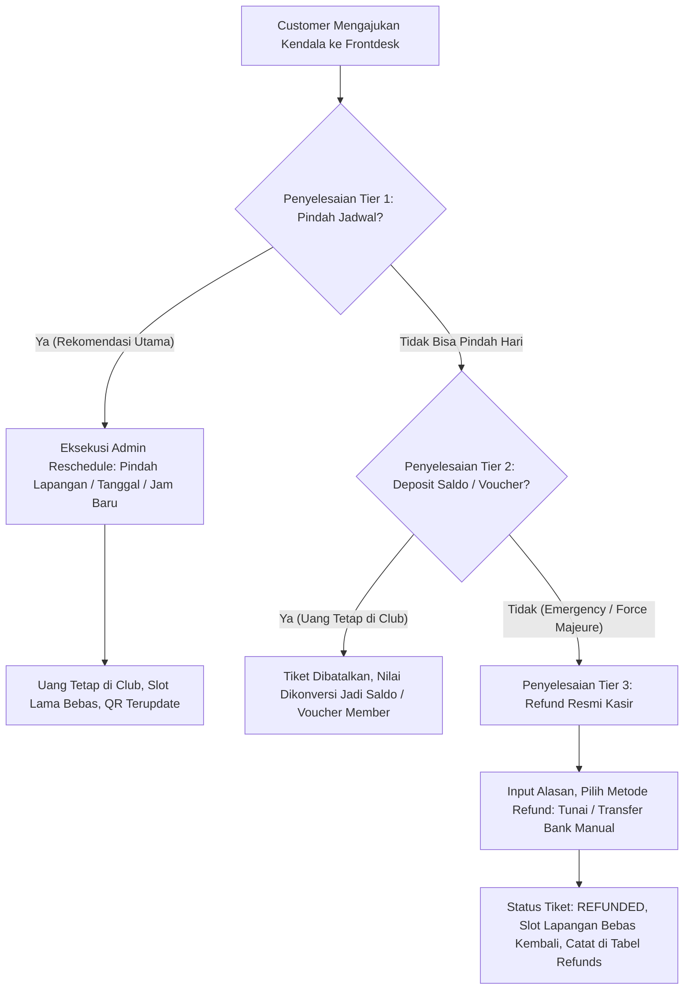
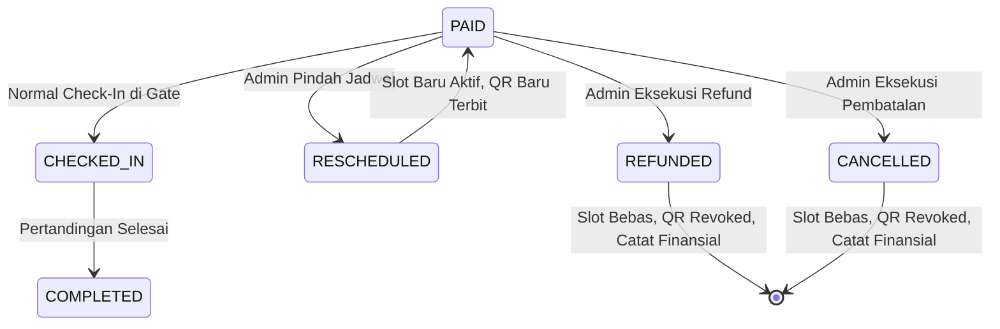

# Product Requirements Document (PRD)
## Modul Ekstensi: Internal Admin Override — Reschedule, Cancellation & Refund Engine ("Pintu Belakang Operator")
**Club 61 Sports & Social Club Central System**

---

| Metadata Dokumen | Spesifikasi |
| :--- | :--- |
| **Kode Dokumen** | `PRD-EXT-02B-INTERNAL-OVERRIDE` |
| **Versi** | `v1.0.0-PROD-OPERATIONAL` |
| **Status** | **Approved Architectural Specification** |
| **Penulis** | Lead Backend Architect & Senior Venue Operations Manager |
| **Target Pengguna** | Manager Venue, Super Admin, Kasir Frontdesk (Filament Backoffice) |
| **Prinsip Utama** | **ZERO PUBLIC ABUSE, HOSPITALITY-DRIVEN, AUDIT-PROOF & ATOMIC RE-ALLOCATION** |

---

## 1. Latar Belakang & Filosofi Bisnis

Dalam industri venue olahraga premium (Padel & Country Club), memberikan akses tombol *Cancel / Refund* atau *Reschedule* secara bebas kepada publik di aplikasi/website merupakan **kesalahan fatal operasional**:
1. **Eksploitasi Slot Prime-Time (Slot Hoarding)**: Pemain memesan slot prime-time (19:00 - 21:00), lalu seenaknya membatalkan 2 jam sebelum main. Lapangan menjadi kosong tanpa pemasukan, padahal antrean member lain sudah ditolak sebelumnya.
2. **Kebocoran Finansial (Payment Gateway Fees)**: Refund otomatis melalui payment gateway (Midtrans/Xendit) membebankan biaya transfer balik dan memotong MDR yang merugikan venue.
3. **Standar Industri Olahraga Eksklusif**: Semua reservasi online diumumkan ke customer sebagai **bersifat final & non-refundable**.

Namun di lapangan nyata, kasir dan manajer sering menghadapi kasus manusiawi:
* Customer salah klik jam (maunya main besok jam 19:00, kepencet hari ini jam 15:00).
* Customer memesan lapangan outdoor, lalu terjadi hujan badai / cuaca ekstrem (*Force Majeure*).
* Customer mengalami cedera mendadak sebelum pertandingan.

### 🛡️ Solusi: Sistem "Pintu Belakang" (Internal Concierge Override)
* **Sisi Customer**: Tidak ada tombol pembatalan mandiri. Tiket mencantumkan tombol bantuan: *"Butuh Perubahan Jadwal? Hubungi Concierge Frontdesk via WhatsApp"*.
* **Sisi Internal (Filament Admin)**: Manajer dan Kasir Frontdesk dibekali wewenang khusus (*override*) untuk memindahkan jadwal, membatalkan transaksi salah pesan, atau memproses refund resmi dengan pencatatan audit yang ketat.

---

## 2. Hirarki Solusi Operasional (3-Tier Resolution Strategy)

Saat customer mengajukan keluhan ke Frontdesk, staf operasional wajib mengikuti hirarki penanganan berikut:



---

## 3. Spesifikasi Kebutuhan Fungsional (Functional Requirements)

---

### FR-01: Pindah Jadwal Kasir / Admin (Internal Reschedule Override)

Fitur ini menangani kasus customer yang **salah klik jam, salah tanggal, atau salah lapangan**, namun tetap ingin bermain di Club 61.

#### 🛡️ 3 Invarian Kritis QA Operasional:
1. **Invarian Kunci Durasi Multi-Jam (Duration-Lock & Contiguous Verification)**:
   * Jika tiket yang di-reschedule berdurasi **3 Jam** (misal: 08:00 - 11:00), form Filament **wajib mengunci durasi 3 jam yang sama**.
   * Dropdown hanya memilih jam mulai (misal: 19:00), dan jam selesai otomatis terkunci menjadi `19:00 + 3 Jam = 22:00`.
   * Backend wajib mengeksekusi *contiguous availability check* untuk memastikan seluruh 3 jam berturut-turut pada lapangan dan tanggal baru tersebut **100% AVAILABLE** (bebas bentrok di DB dan Redis lock).
2. **Invarian Akuntansi Selisih Tarif (Price Delta Settlement)**:
   * Selisih dihitung: $\Delta = \text{Tarif Lapangan Baru} - \text{Tarif Lapangan Lama}$.
   * **Kasus Kurang Bayar ($\Delta > 0$, misal Reguler ke Prime)**:
     * Sistem wajib menerbitkan *supplemental invoice / payment record* di tabel `payments`.
     * Tiket di jadwal baru berstatus `LOCKED` (belum rilis QR baru) sampai kasir memproses pembayaran selisih (Cash / EDC / QRIS) di meja kasir.
   * **Kasus Lebih Bayar ($\Delta < 0$, misal Prime ke Reguler)**:
     * Selisih kembalian otomatis dicatat ke tabel `refunds` sebagai saldo deposit member atau pengembalian kasir.
     * Neraca transaksi di tabel `orders` tetap terjaga seimbang: $\text{Bayar Awal} = \text{Tarif Baru} + \text{Refund}$.
   * **Kasus Tarif Sama ($\Delta = 0$)**: Langsung dimutasi tanpa transaksi finansial.
3. **Invarian Aksi Atomik (`DB::transaction`)**:
   * Seluruh mutasi (`court_id`, `start_time`, `end_time`, `court_fee`, pencabutan `qr_code_hash` lama, penerbitan QR baru, pembuatan record `payments` atau `refunds`, serta transfer cache lock) **WAJIB dibungkus dalam 1 blok `DB::transaction()`**.
   * Jika terjadi tabrakan di detik yang sama, seluruh operasi otomatis di-rollback tanpa sisa inkonsistensi data.

#### Alur Kerja (Workflow):
1. Kasir membuka halaman **Kelola Pemesanan & Tiket** (`/admin/kelola-pemesanan`).
2. Cari booking berdasarkan Kode Booking (`#BK-PAD-...`), Nama Customer, atau No WhatsApp.
3. Klik tombol aksi: **"Pindah Jadwal"** (ikon kalender emas).
4. Muncul Modal Form:
   * **Info Durasi Tiket**: Terkunci otomatis (misal: `3 Jam`).
   * **Pilih Lapangan Baru**: Dropdown lapangan aktif (`Court 1`, `Court 2`, dst.).
   * **Pilih Tanggal Baru**: Date picker (hanya hari ini atau masa depan).
   * **Pilih Jam Mulai**: Dropdown jam operasional. Jam selesai otomatis terkalkulasi `start_time + durasi`.
   * **Kalkulasi Selisih Tarif Real-Time**:
     * Menampilkan: Tarif Lama vs Tarif Baru &rarr; Nominal Selisih ($\Delta$).
     * Pilihan metode bayar jika kurang bayar (Tunai / EDC / QRIS).
   * **Catatan Kasir**: Input teks wajib (contoh: *"Customer salah pilih jam, konfirmasi via WA"*).
5. Klik **"Simpan & Pindahkan"**. Sistem mengeksekusi `DB::transaction()` atomik.
6. Hasil di sisi customer: Begitu refresh `/invoice`, boarding pass langsung terupdate ke jadwal baru dengan durasi utuh 3 jam.

---

### FR-02: Pembatalan & Refund Resmi Kasir (Internal Void / Refund)

Fitur ini menangani kasus darurat di mana customer **benar-benar tidak bisa bermain** (misal: lapangan outdoor hujan lebat, cedera medis, atau kesalahan fatal sistem).

#### Alur Kerja (Workflow):
1. Manajer / Kasir membuka detail tiket di Admin Filament.
2. Klik tombol aksi: **"Batalkan & Refund"** (ikon tanda silang merah / pengembalian dana).
3. Muncul Modal Konfirmasi Refund:
   * **Nominal Refund**:
     * *Pilihan 1: Full Refund (100%)* &mdash; Untuk kasus force majeure (hujan lebat / lampu mati).
     * *Pilihan 2: Potongan Biaya Administrasi (Custom Nominal)* &mdash; Misal dipotong Rp 50.000 sesuai kebijakan pembatalan H-24.
   * **Metode Pengembalian Dana**:
     * `TUNAI_KASIR`: Uang fisik diserahkan langsung oleh kasir di meja frontdesk.
     * `TRANSFER_MANUAL`: Staf finance mentransfer balik ke rekening bank customer (input Nomor Rekening & Nama Bank).
     * `DEPOSIT_MEMBER`: Uang dimasukkan kembali sebagai saldo deposit member untuk booking berikutnya (uang tetap berada di Club 61).
   * **Alasan Pembatalan Resmi**: Dropdown pilihan + Textarea catatan:
     * *Pilihan*: `FORCE_MAJEURE_WEATHER` (Hujan Badai), `CUSTOMER_EMERGENCY` (Cedera/Sakit), `BOOKING_ERROR` (Salah Pesan), `MAINTENANCE` (Perbaikan Lapangan).
     * *Catatan*: Teks penjelasan wajib untuk audit owner/finance.
4. **Eksekusi Atomik Database**:
   * Status booking diubah menjadi **`CANCELLED`** atau **`REFUNDED`**.
   * Kolom `cancel_reason` diisi dengan alasan resmi.
   * Slot lapangan lama **SEKETIKA DIBEBASKAN** (`AVAILABLE`) di website publik.
   * Hash QR Code tiket **DIMATIKAN (REVOKED)**. Jika QR tiket lama dicoba di-scan di pintu gate, sistem scanner akan menolak: *"Peringatan: Tiket ini telah DIBATALKAN/DI-REFUND pada {tanggal}"*.
   * Dibuat 1 baris rekam jejak di tabel **`refunds`** lengkap dengan ID staf pemroses, nominal, dan metode refund.

---

## 4. Matriks Otoritas & Hak Akses Staf (RBAC)

Untuk mencegah kebocoran uang kasir, hak akses diatur sebagai berikut:

| Peran (Role) | Pindah Jadwal (Reschedule) | Refund Saldo Deposit | Refund Tunai / Transfer Bank |
| :--- | :---: | :---: | :---: |
| **Kasir Frontdesk** | ✅ Diizinkan (Maks. 1x pindah) | ✅ Diizinkan | ❌ Butuh Persetujuan Manager |
| **Manager Venue** | ✅ Bebas | ✅ Bebas | ✅ Bebas (Otoritas Penuh) |
| **Super Admin / Owner**| ✅ Bebas | ✅ Bebas | ✅ Bebas (Full Control) |
| **Customer Publik** | ❌ Dilarang (Pintu Ditutup) | ❌ Dilarang | ❌ Dilarang |

---

## 5. State Machine Siklus Hidup Tiket Pasca Pembatalan



---

## 6. Struktur Skema Database Pendukung

Fitur ini memanfaatkan kolom-kolom yang sudah ada di database kita tanpa perlu migrasi besar:

### 1. Tabel `padel_bookings`:
* `status`: Nilai state machine (`PAID`, `CHECKED_IN`, `CANCELLED`, `REFUNDED`).
* `reschedule_count`: Integer pencatat frekuensi pindah jadwal.
* `cancel_reason`: Teks catatan audit alasan pembatalan.
* `qr_code_hash`: Di-regenerate saat reschedule, di-set `NULL` / `REVOKED` saat refund.

### 2. Tabel `refunds` (Tabel Finansial Resmi):
* `id`: ULID Primary Key.
* `order_id`: Relasi ke Order transaksi.
* `payment_id`: Relasi ke ID pembayaran awal.
* `refund_amount`: Nominal rupiah yang dikembalikan.
* `reason`: Alasan pembatalan resmi.
* `status`: `PROCESSED`.
* `processed_at`: Timestamp eksekusi oleh staf kasir.

---

## 7. Desain Antarmuka Filament Admin (Wireframe Konseptual)

### A. Tampilan Baris Pemesanan Normal & Status Tagihan Menggantung:
```text
Normal Lunas:
[ #BK-PAD-8812 ] [ Andi Wijaya ] [ Court 1 • 19:00 - 22:00 WIB ] [ PAID ] [ Rp 600.000 ] 
                                                   [ 📅 Pindah Jadwal ] [ ❌ Refund / Batal ]

Kurang Bayar Reschedule (QR Ditahan - Indikator Merah Mencolok):
[ #BK-PAD-8812 ] [ Andi Wijaya ] [ Court 1 • 19:00 - 22:00 WIB ] [ ⚠️ KURANG BAYAR: Rp 100.000 ] 
                                                   [ 💳 Lunasi Tagihan ] [ 📅 Pindah Jadwal ] [ ❌ Batal ]
```

### B. Modal Dialog "Pindah Jadwal":
```text
+-------------------------------------------------------------------+
| 📅 PINDAH JADWAL RESERVASI (ADMIN OVERRIDE)                       |
+-------------------------------------------------------------------+
| Customer : Andi Wijaya (#BK-PAD-8812)                             |
| Jadwal Saat Ini : Court 1 - Panoramic • 08 Sep, 08:00 - 11:00 WIB |
| Durasi Sesi     : 3 Jam (Terkunci Otomatis - Anti-Jebakan Durasi) |
| Peralatan Sewa  : 2x Bullpadel Hack 03 (Otomatis Terikut Order ID)|
|                                                                   |
| [ Pilih Lapangan Tujuan ] : [ Court 2 - Panoramic Indoor      v ] |
| [ Tanggal Baru          ] : [ 2026-09-10 (Min: Hari Ini)      📅] |
| [ Jam Mulai Baru        ] : [ 19:00 WIB                       v ] |
|                            -> Jam Selesai Otomatis: 22:00 WIB     |
|                                                                   |
| 💰 PERHITUNGAN SELISIH TARIF (PRICE DELTA):                       |
|   • Tarif Sesi Lama (Reguler 3 Jam) : Rp 600.000                  |
|   • Tarif Sesi Baru (Prime 3 Jam)   : Rp 900.000                  |
|   • Selisih Kurang Bayar            : Rp 300.000 (WAJIB DIBAYAR)  |
|                                                                   |
| [ Opsi Pelunasan Kasir  ] : ( * ) Lunasi Sekarang di Frontdesk    |
|                             (   ) Terbitkan Tagihan Pending (Lock)|
| [ Metode Bayar Selisih  ] : [ Tunai Kasir / EDC Frontdesk     v ] |
| [ Alasan Perubahan      ] : [ Customer salah klik via WA        ] |
|                                                                   |
| ( i ) Seluruh 3 jam lama akan dilepas dan 3 jam baru dikunci      |
|       secara atomik dalam DB::transaction().                      |
|                                                                   |
|                       [ Batal ]   [ 💾 Simpan & Proses Jadwal ]   |
+-------------------------------------------------------------------+
```

### C. Modal Dialog "Batalkan & Refund":
```text
+-------------------------------------------------------------------+
| ❌ BATALKAN RESERVASI & REFUND RESMI                              |
+-------------------------------------------------------------------+
| Customer : Budi Santoso (#BK-PAD-9901)                            |
| Total Bayar : Rp 300.000 (Midtrans QRIS)                          |
|                                                                   |
| [ Alasan Pembatalan     ] : [ Force Majeure - Hujan Badai Outdoorv]|
| [ Nominal Pengembalian  ] : [ Rp 300.000                        ] |
| [ Metode Pengembalian   ] : [ Tunai Kasir Frontdesk           v ] |
| [ Catatan Kasir         ] : [ Lapangan basah kuyup, dana tunai  ] |
|                             [ diserahkan ke customer langsung.  ] |
|                                                                   |
| ( ! ) QR Tiket akan DIMATIKAN dan slot otomatis dibuka kembali.   |
|                                                                   |
|                       [ Tutup ]   [ ⚠️ Konfirmasi & Refund ]      |
+-------------------------------------------------------------------+
```

---

## 8. Ringkasan Keuntungan Bisnis & Operasional

1. **Anti-Slot Hoarding**: Customer nakal tidak bisa sembarangan membatalkan slot di detik-detik terakhir.
2. **Kerapian Pembukuan**: Setiap rupiah yang keluar dari kasir tercatat jelas nominalnya, tanggalnya, dan siapa staf yang bertanggung jawab.
3. **Anti-Tanggal Lampau**: Kasir terkunci hanya bisa memilih tanggal hari ini atau masa depan.
4. **Flat Equipment Zero-Overhead**: Karena `padel_booking_equipments` terikat pada `order_id`, sewa raket dan bola otomatis terikut tanpa perlu pemindahan record manual.
5. **Indikator Tagihan Menggantung**: Adanya badge merah mencolok di tabel Filament mengeliminasi risiko kelupaan kasir saat menagih selisih bayar ketika pemain datang ke venue.
6. **Zero Code Dependency**: Begitu fitur ini aktif, admin venue Medan bisa menyelesaikan semua kasus sehari-hari tanpa perlu bantuan programmer lagi.
