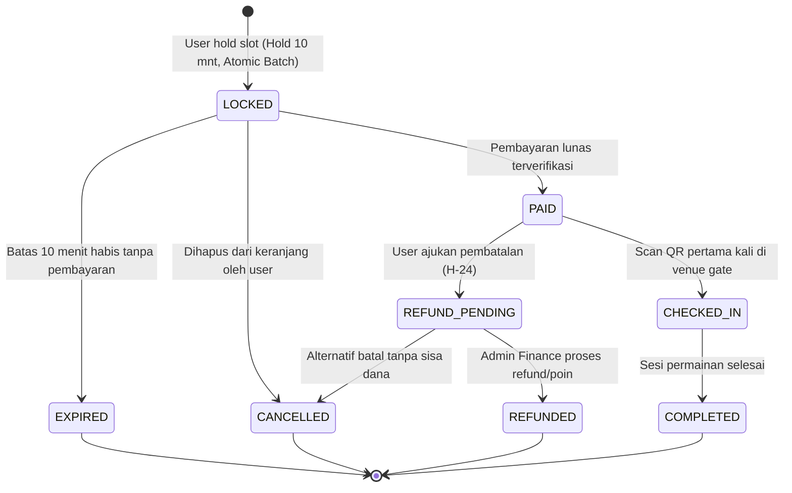

# Product Requirements Document (PRD) — REVISED v1.1.0 (Production Hardened)
## Modul 02: Padel Court Booking Engine
**Club 61 Sports & Social Club Central API**

---

| Metadata Dokumen | Spesifikasi |
| :--- | :--- |
| **Versi** | `1.1.0-PROD-HARDENED` (Revisi QA & Senior Architect) |
| **Status** | **Approved Architectural Specification** |
| **Penulis** | Lead Backend Architect & Senior QA Lead Engineer |
| **Target Konsumen** | Flutter Mobile App (iOS/Android), Web Customer Portal, Frontdesk POS Kasir |
| **Prinsip Utama** | **ZERO DATA RACE, ATOMIC MULTI-SLOT, 100% IDEMPOTENT & ANTI-DOUBLE-BOOKING** |

---

## 1. Latar Belakang & Visi Arsitektur

Padel Court Booking Engine adalah **jantung operasional dan mesin penghasil revenue utama** bagi Club 61. Sistem ini mengelola seluruh alur reservasi lapangan (Lapangan 1 Panoramic & Lapangan 2 Tournament), penyewaan alat (raket carbon pro, bola kaleng, sparring coach), penguncian slot waktu (*hold slot*), checkout pembayaran multi-channel, hingga validasi check-in di gate venue.

### 🛡️ 5 Pilar Kualitas Eksekutif (Senior Architect & QA Mandate):
1. **Atomic Multi-Slot (All-or-Nothing)**: Pemesanan multi-jam wajib bersifat atomik penuh. Jika salah satu jam bentrok, seluruh keranjang otomatis batal di-hold.
2. **Strict Time-Overlap Mathematical Precision**: Rumus query database menggunakan batas terbuka ketat (`<` dan `>`) tanpa jebakan overlap operator `<=` pada pergantian jam.
3. **State Machine Bersih dengan Jalur Refund**: Pemisahan tegas antara pembatalan tanpa bayar (`EXPIRED`/`CANCELLED`) dan pembatalan pasca bayar H-24 (`REFUND_PENDING` &rarr; `REFUNDED`).
4. **Single-Use Check-In & Anti-Replay Attack**: Proteksi absolut terhadap scan ganda tiket QR (screenshot sharing). Sekali berstatus `CHECKED_IN`, scan kedua langsung ditolak.
5. **Idempotent Checkout dengan 24h Expiry**: Proteksi debit ganda mobile menggunakan header `X-Idempotency-Key` yang kedaluwarsa dalam 24 jam untuk mencegah bloating storage.

---

## 2. Aktor & User Persona

| Aktor | Peran & Akses | Kebutuhan Utama |
| :--- | :--- | :--- |
| **Customer (Member)** | Pemain via Mobile Flutter / Web | Melihat ketersediaan jadwal, mengunci multi-slot (atomic), menambah add-on alat, checkout idempotent, dan mendapatkan tiket QR. |
| **Walk-In Guest** | Tamu yang datang langsung ke venue | Reservasi di tempat dibantu staf kasir melalui antarmuka POS Frontdesk. |
| **Staff Kasir / Gate Marshall** | Petugas resepsionis & gate turnstile | Memvalidasi QR Code tiket pemain saat check-in, memastikan jendela waktu sesuai, dan mengeksekusi single-use lock. |
| **Manager / Super Admin** | Pengelola venue di Filament Backoffice | Mengatur tarif (reguler vs prime time), memproses antrean `REFUND_PENDING`, dan memantau okupansi. |

---

## 3. Spesifikasi Kebutuhan Fungsional (Functional Requirements)

### FR-01: Matrix Jadwal & Ketersediaan Lapangan (Timezone-Aware)
- **Deskripsi**: Endpoint publik untuk melihat ketersediaan jam dari pukul **06:00 s/d 23:00 WIB** (interval 60 menit).
- **Parameter & Format**:
  - `date`: `YYYY-MM-DD` (Wajib, validasi `after_or_equal:today`).
  - `timezone`: String zona waktu (Default: `Asia/Jakarta`).
  - Seluruh timestamp pada response disajikan dalam format standar **ISO 8601 UTC** (`YYYY-MM-DDTHH:mm:ssZ`) dengan atribut pendukung waktu lokal untuk rendering instan di Flutter.
- **Aturan Tarif Jam**:
  - Jam Reguler: 06:00 - 17:00 WIB (Tarif normal: Rp 200.000 / jam).
  - Jam Prime Time: 17:00 - 23:00 WIB & Weekend (Tarif prime: Rp 300.000 - Rp 400.000 / jam).
- **Definisi Status Slot**:
  - `AVAILABLE`: Lapangan kosong dan siap dipesan.
  - `LOCKED`: Sedang di-hold oleh pemain lain (maksimal 10 menit).
  - `BOOKED`: Sudah dibayar lunas oleh pemain lain (`PAID` atau `CHECKED_IN`).
  - `MAINTENANCE`: Lapangan ditutup untuk perawatan.
- **Proteksi Privasi**: Nama dan identitas user yang mem-booking **di-masking penuh** (hanya mengembalikan status `BOOKED`).

### FR-02: Katalog Sewa Alat & Add-Ons (Equipments & Coach)
- **Deskripsi**: Katalog add-on yang dapat dipilih saat hold slot atau checkout.
- **Daftar Bawaan**:
  - Raket Carbon Pro (Siux Genesis / Bullpadel Hack) - Rp 50.000 / pcs.
  - Can Bola Padel Baru (Head Padel Pro 3 pcs) - Rp 75.000 / kaleng.
  - Paket Fresh (Handuk Dingin + 2 Mineral Water) - Rp 25.000 / paket.
  - Sesi Instruktur / Sparring Coach - Rp 150.000 / jam.

### FR-03 & FR-04: Atomic Multi-Slot Hold Engine (Anti Double-Booking All-or-Nothing)
- **Deskripsi**: Penguncian slot jam lapangan berdurasi **10 menit (600 detik)**.
- **Prinsip Atomic All-or-Nothing**:
  - User dapat mengirimkan *batch slot* (misal: 08:00 - 09:00 dan 09:00 - 10:00).
  - Jika **seluruh slot** berhasil dikunci, maka transaksi sukses (`201 Created`).
  - Jika **ada 1 saja slot** yang gagal dikunci (sedang di-hold / sudah dibooking orang lain), maka **SELURUH slot dalam request tersebut otomatis dibatalkan / di-rollback**, dan sistem mengembalikan `409 Conflict`. Pemain tidak akan ditinggalkan dengan reservasi setengah jadi.
- **Arsitektur Pengamanan Ganda (Two-Tier Concurrency Defense)**:
  1. **Tier 1 - Distributed Multi-Lock (Memory/Cache)**:
     - Mengunci seluruh slot secara berurutan (*sorted keys* untuk mencegah deadlock) dengan TTL 600 detik.
     - Jika ada 1 lock gagal didapat, lepaskan seluruh lock yang sudah terlanjur diambil dalam iterasi tersebut.
  2. **Tier 2 - ACID Database Pessimistic Lock (`SELECT ... FOR UPDATE`)**:
     - Dijalankan di dalam `DB::transaction`.
     - Mengecek overlap jadwal aktif (`LOCKED`, `PAID`, `CHECKED_IN`).

### 📐 Rumus Matematis Query Overlap Waktu (Wajib Diimplementasikan di Service):
> [!CAUTION]
> **HARAM menggunakan operator `<=` atau `>=` pada batas waktu!**
> Penggunaan operator `<=` akan menyebabkan Booking A (08:00 - 09:00) dan Booking B (09:00 - 10:00) saling tolak padahal jamnya bersambung.
>
> **Rumus SQL Presisi Tinggi**:
> ```sql
> WHERE court_id = :court_id
>   AND booking_date = :booking_date
>   AND status IN ('LOCKED', 'PAID', 'CHECKED_IN')
>   AND start_time < :request_end_time
>   AND end_time > :request_start_time
> ```

### FR-05: Checkout & Idempotency Key Engine
- **Deskripsi**: Pembayaran batch booking yang sedang berstatus `LOCKED`.
- **Wajib Header**: `X-Idempotency-Key: <UUIDv4>`
  - Disimpan di Cache / Redis dengan TTL **24 Jam (86.400 detik)** untuk mencegah bloating storage.
  - Jika ada request berulang dengan `X-Idempotency-Key` yang sama, kembalikan cached response sebelumnya tanpa mengeksekusi debit/transaksi ulang.
- **Kalkulasi Biaya**:
  $$\text{Grand Total} = \sum \text{Court Fee} + \sum \text{Equipment Fee} + \text{Coach Fee} + \text{Biaya Layanan Gateway} - \text{Diskon Promo}$$

### FR-06: Scheduler Otomatis Pelepasan Slot Kedaluwarsa (Garbage Collection)
- **Deskripsi**: Command `padel:release-expired-slots` dijadwalkan berjalan **setiap 1 menit**.
- **Aksi**:
  - Mencari booking berstatus `LOCKED` di mana `created_at + 10 menit < NOW()`.
  - Mengubah status menjadi `EXPIRED`.
  - Menghapus Distributed Cache Lock terkait sehingga slot langsung kembali `AVAILABLE` untuk publik.

### FR-07: E-Tiket & Kriptografi Hash QR Code
- Setiap booking `PAID` menghasilkan `qr_code_hash`:
  $$\text{qr\_code\_hash} = \text{hash\_hmac}('sha256', \text{booking\_code} . \text{user\_id} . \text{court\_id} . \text{start\_time}, \text{config}('app.key'))$$

### FR-08: Validasi Check-In di Venue (Anti-Replay / Single-Use Guarantee)
- **Deskripsi**: Kasir atau turnstile gate melakukan scan QR Code pemain.
- **Aturan Eksekusi di Controller**:
  1. Validasi keberadaan hash & status booking harus `PAID`.
  2. Jendela waktu check-in: Maksimal 45 menit sebelum kick-off s/d 30 menit sebelum sesi berakhir.
  3. **Proteksi Anti-Replay**: Catat `checked_in_at = NOW()`, ubah status menjadi `CHECKED_IN`.
  4. Jika tiket di-scan untuk kedua kalinya, sistem **WAJIB MENOLAK** dengan pesan error:
     `409 Conflict: Tiket ini sudah pernah digunakan untuk check-in pada pukul {checked_in_at}.`

### FR-09: Kebijakan Pembatalan & Jalur Refund Resmi
- Pembatalan hanya dapat dilakukan mandiri oleh user maksimal **H-24 sebelum jadwal pertandingan**.
- **State Machine Jalur Pembatalan**:
  - Pembatalan Booking Belum Bayar: `LOCKED` &rarr; `CANCELLED` (Slot langsung bebas).
  - Pembatalan Booking Lunas (H-24): `PAID` &rarr; `REFUND_PENDING` (Uang/poin masuk antrean finance admin) &rarr; `REFUNDED`.

---

## 4. State Machine & Siklus Hidup Booking (Lengkap)



---

## 5. Kebutuhan Non-Fungsional & Keamanan (NFR)

| Parameter | Spesifikasi Teknis |
| :--- | :--- |
| **Concurrency Isolation** | Database Isolation Level `READ COMMITTED` + `SELECT ... FOR UPDATE`. |
| **Idempotency Expiry** | Key `idempotency:{key}` disimpan di Redis/Cache dengan TTL **24 Jam (86.400 detik)**. |
| **Rate Limiter Anti-Bot** | `POST /hold-slot` dibatasi maksimal **5 request / menit / user ID atau IP** (`booking-throttle`). |
| **API Latency Target** | Matrix Schedule $< 40\text{ ms}$ (Redis cached), Hold Slot $< 90\text{ ms}$. |
| **Integrity Guard** | Foreign key constraints ON DELETE CASCADE untuk relasi equipment booking. |

---

## 6. Spesifikasi Kontrak REST API (Payload Terstandardisasi)

### A. Endpoint Publik
#### 1. `GET /api/v1/padel/courts`
Mengembalikan daftar lapangan padel, fasilitas, dan foto.

#### 2. `GET /api/v1/padel/schedule`
* **Query Params**:
  * `date`: `2026-09-10` (Opsional, default hari ini)
  * `timezone`: `Asia/Jakarta` (Opsional)
* **Response Body (200 OK)**:
  ```json
  {
    "success": true,
    "message": "Jadwal lapangan padel berhasil diambil.",
    "data": {
      "date": "2026-09-10",
      "timezone": "Asia/Jakarta",
      "courts": [
        {
          "court_id": "01m1k531b1rsg898ybdpbgsy7m",
          "court_name": "Lapangan 1 (Panoramic Pro)",
          "type": "INDOOR",
          "slots": [
            {
              "time": "08:00 - 09:00",
              "start_time": "2026-09-10T01:00:00Z",
              "end_time": "2026-09-10T02:00:00Z",
              "local_start": "08:00",
              "local_end": "09:00",
              "status": "AVAILABLE",
              "is_prime_time": false,
              "original_price": 300000,
              "price": 200000
            }
          ]
        }
      ]
    }
  }
  ```

#### 3. `GET /api/v1/padel/equipments`
Mengembalikan daftar raket sewa, bola kaleng, paket fresh, dan pelatih.

---

### B. Endpoint Private Member (Header: `Authorization: Bearer <token>`)

#### 4. `POST /api/v1/padel/hold-slot` (Atomic Multi-Slot)
* **Request Body**:
  ```json
  {
    "booking_date": "2026-09-10",
    "slots": [
      {
        "court_id": "01m1k531b1rsg898ybdpbgsy7m",
        "start_time": "08:00",
        "end_time": "09:00"
      },
      {
        "court_id": "01m1k531b1rsg898ybdpbgsy7m",
        "start_time": "09:00",
        "end_time": "10:00"
      }
    ],
    "coach_id": null
  }
  ```
* **Response (201 Created - All-or-Nothing Sukses)**:
  ```json
  {
    "success": true,
    "message": "2 slot lapangan berhasil dikunci selama 10 menit.",
    "data": {
      "batch_id": "BATCH-PAD-882194",
      "expires_at": "2026-09-10T08:10:00Z",
      "hold_seconds_remaining": 600,
      "bookings": [
        {
          "id": "01m1njqs8cjxcwt7d6x4f8thc2",
          "booking_code": "BK-PADEL-A8F291B0",
          "court_id": "01m1k531b1rsg898ybdpbgsy7m",
          "start_time": "08:00",
          "end_time": "09:00",
          "court_fee": 200000,
          "status": "LOCKED"
        }
      ],
      "subtotal": 400000
    }
  }
  ```

#### 5. `POST /api/v1/padel/release-slot`
* **Request Body**: `{ "booking_ids": ["01m1njqs8cjxcwt7d6x4f8thc2"] }`
* Melepaskan lock secara sukarela saat item dihapus dari keranjang.

#### 6. `POST /api/v1/padel/checkout` (Idempotent Payment Initialization)
* **Header Wajib**: `X-Idempotency-Key: 9b1deb4d-3b7d-4bad-9bdd-2b0d7b3dcb6d`
* **Request Body**:
  ```json
  {
    "booking_ids": [
      "01m1njqs8cjxcwt7d6x4f8thc2",
      "01m1njqs8cjxcwt7d6x4f8thc3"
    ],
    "equipments": [
      { "equipment_id": "01m1k531b1rsg898ybdpbgsy88", "quantity": 2 }
    ],
    "voucher_code": "HEMAT10",
    "payment_method": "QRIS"
  }
  ```
* **Response (200 OK)**: Mengembalikan rincian biaya, nomor VA atau string QRIS, dan payload pembayaran.

#### 7. `GET /api/v1/padel/my-bookings`
Riwayat booking pemain terbagi tab: `UPCOMING`, `COMPLETED`, `CANCELLED`.

#### 8. `GET /api/v1/padel/bookings/{id}/ticket`
Mengembalikan payload tiket, detail jadwal, dan hash QR Code.

---

### C. Endpoint Staf Venue & Kasir Gate (Role: `CASHIER`, `ADMIN`, `SUPER_ADMIN`)

#### 9. `POST /api/v1/padel/check-in` (Single-Use Ticket Scanner)
* **Request Body**: `{ "qr_code_hash": "e3b0c44298fc1c149afbf4c8996fb92427ae41e4649b934ca495991b7852b855" }`
* **Response (200 OK - Scan Pertama)**:
  ```json
  {
    "success": true,
    "message": "Check-in berhasil! Selamat bertanding.",
    "data": {
      "booking_code": "BK-PADEL-A8F291B0",
      "player_name": "Andi Wijaya",
      "court_name": "Lapangan 1 (Panoramic Pro)",
      "schedule": "08:00 - 10:00 WIB",
      "checked_in_at": "2026-09-10T07:45:12Z"
    }
  }
  ```
* **Response (409 Conflict - Percobaan Scan Kedua / Replay Attack)**:
  ```json
  {
    "success": false,
    "message": "Akses Ditolak! Tiket ini sudah pernah di-check-in sebelumnya pada pukul 07:45 WIB.",
    "errors": { "code": "TICKET_ALREADY_USED" }
  }
  ```

---

## 7. Matriks Pengujian QA Komprehensif (Automated Test Suite)

| Kasus Uji (Test Case) | Metode Eksekusi | Kriteria Kelulusan QA (Pass Criteria) |
| :--- | :--- | :--- |
| **Atomic Multi-Slot Rollback** | User minta 2 slot (Slot A kosong, Slot B sudah di-lock user lain). | Response `409 Conflict`. **Slot A TIDAK BOLEH terkunci** (harus tetap available). |
| **Boundary Time Overlap** | Booking A: 08:00-09:00, Booking B: 09:00-10:00. | Booking B **SUKSES 201 Created** (tidak bentrok pada pergantian menit 09:00). |
| **Partial Overlap Rejection** | Booking A: 08:00-10:00, Booking B: 09:00-11:00. | Booking B **DITOLAK 409 Conflict** (tabrakan di jam 09:00-10:00). |
| **Time-Reversal Validation** | `start_time: 10:00`, `end_time: 09:00`. | Ditolak `422 Unprocessable Content`. |
| **Past Date Validation** | `booking_date: kemarin`. | Ditolak `422 Unprocessable Content`. |
| **Idempotency Protection** | Hit `/checkout` 2x dengan `X-Idempotency-Key` yang sama persis. | Response identik, **tidak terjadi duplikasi record pembayaran di DB**. |
| **Single-Use Check-In** | Scan QR tiket 2 kali berturut-turut. | Scan 1 `200 OK`, Scan 2 **DITOLAK 409 TICKET_ALREADY_USED**. |
| **Garbage Collection Expiry** | Jalankan `padel:release-expired-slots` pada slot berumur $>10$ menit. | Status berubah `EXPIRED`, slot kembali `AVAILABLE` di `/schedule`. |
