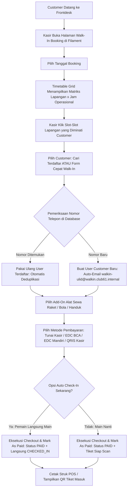

# Product Requirements Document (PRD)
## Modul 11: Walk-In Offline Booking & Frontdesk POS Slot Dispatcher ("Loket Reservasi Kasir")
**Club 61 Sports & Social Club Central System**

---

| Metadata Dokumen | Spesifikasi |
| :--- | :--- |
| **Kode Dokumen** | `PRD-MODUL-11-WALK-IN-OFFLINE-BOOKING` |
| **Versi** | `v1.2.0-CHANNEL-SEPARATED` |
| **Status** | **Approved Architectural Specification** |
| **Penulis** | Lead Backend Architect & Venue Operational Product Lead |
| **Target Pengguna** | Kasir Frontdesk, Resepsionis Venue, Administrator (Filament Panel) |
| **Prinsip Utama** | **FAST CHECKOUT (< 30s), SMART DEDUPLICATION, TIMETABLE VISIBILITY, ATOMIC CONCURRENCY** |

---

## 1. Latar Belakang & Filosofi Bisnis

Pada operasional harian venue padel premium, tidak semua pemain melakukan reservasi secara mandiri melalui web/aplikasi seluler. Sejumlah pemain datang langsung ke lokasi (*walk-in*) dengan kondisi:
1. **Pemain Spontan (On-the-Spot Players)**: Datang langsung ke venue untuk mengecek apakah ada lapangan kosong yang bisa langsung dimainkan saat itu juga.
2. **Tamu VIP / Tamu Asing**: Enggan atau kesulitan mengunduh aplikasi / registrasi mandiri karena kendala bahasa, jaringan, atau preferensi privasi.
3. **Pemesanan Offline Via Telepon / WhatsApp Kasir**: Menghubungi resepsionis frontdesk untuk mengamankan slot dan membayar secara tunai atau kartu saat tiba di venue.

### Permasalahan Tanpa Modul Walk-In Terdedikasi:
- Staf kasir terpaksa meminjam handphone pribadi atau membuka browser incognito untuk login sebagai customer palsu, yang memakan waktu lama (> 3 menit) dan berisiko salah akun.
- Data pelanggan offline tercecer atau menggunakan 1 akun dummy statis ("Guest"), sehingga data analitik frekuensi bermain, CRM, dan riwayat pendapatan kustomer menjadi bias.
- Risiko *double booking* jika staf mencatat manual di buku kertas sementara customer online memesan slot yang sama di waktu bersamaan.

### Solusi: Modul Walk-In Offline Booking Filament
Menyediakan antarmuka visual khusus bagi staf kasir di Filament Admin Panel (`BookOfflineCourt.php`) yang memungkinkan staf melihat seluruh ketersediaan lapangan dalam bentuk **Timetable Grid**, memilih slot dalam 1 klik, mendaftarkan customer secara instan dengan deduplikasi nomor telepon, dan langsung menyelesaikan pembayaran kasir secara lunas (*settled*) dalam waktu kurang dari 30 detik.

---

## 2. Arsitektur Alur Kerja (Workflow Architecture)



---

## 3. Spesifikasi Kebutuhan Fungsional (Functional Requirements)

---

### FR-01: Quick Customer Deduplication Engine ("Walk-In Quick Create")

1. **Pilihan Input Customer pada Panel Kasir**:
   - **Mode A: Cari Pelanggan Terdaftar**: Dropdown pencarian reaktif (Livewire Search) berdasarkan Nama, No. Telepon, atau Email.
   - **Mode B: Form Cepat Walk-In**: Form modal/inline sederhana hanya berisi 3 field:
     - `name`: Wajib (String, maks 100 karakter).
     - `phone`: Wajib (String, dinormalisasi ke format lokal standar, misal `08xxxxxxxxxx`).
     - `email`: Opsional (Jika diisi manual, gunakan email tersebut; jika dikosongkan, sistem meng-generate email internal sintetis).
2. **Logika Deduplikasi (Anti-Duplikasi Akun)**:
   ```php
   $user = User::where('phone', $normalizedPhone)->first();
   if (! $user) {
       $user = User::create([
           'name' => $name,
           'phone' => $normalizedPhone,
           'email' => $email ?: ('walkin-' . strtolower((string) Str::ulid()) . '@walkin.club61.internal'),
           'password' => bcrypt(Str::random(32)),
           'role' => 'CUSTOMER', // Memicu setRoleAttribute() dan hook booted() otomatis meng-assign role 'customer'
           'is_active' => true,
           'registration_source' => 'WALK_IN',
       ]);
   }
   ```
3. **Pembeda Sumber Registrasi**:
   - Menambahkan kolom `registration_source` bertipe string pada tabel `users` dengan nilai: `'ONLINE'` (default aplikasi), `'WALK_IN'` (dibuat kasir), `'POS'` (dibuat kasir F&B).
   - Kolom ini mencatat **asal akun** (sekali, saat user pertama kali dibuat) — berbeda dan tidak tumpang tindih dengan `orders.order_type` (lihat FR-04.2) yang mencatat **kanal tiap transaksi** setiap kali Order baru dibuat. Seorang customer ber-`registration_source = 'WALK_IN'` bisa saja kelak melakukan booking mandiri via aplikasi, dan order tersebut tetap benar tercatat sebagai `order_type = 'ONLINE_BOOKING'`; begitu pula sebaliknya.
   - Memudahkan audit dan pelaporan CRM untuk menganalisis rasio konversi pemain offline ke online tanpa memecah integritas akun customer.

---

### FR-02: Visual Timetable Schedule Matrix (Bukan Galeri Kartu)

1. **Struktur Tampilan Matriks**:
   - **Sumbu Y (Baris)**: Daftar seluruh lapangan aktif (Court 1: Panoramic Indoor, Court 2: Panoramic Indoor, Court 3: Open Air Outdoor).
   - **Sumbu X (Kolom)**: Jam operasional dari pukul 06:00 hingga 23:00 (slot per 1 jam).
2. **Status Visual Sel Slot**:
   - `AVAILABLE`: Sel berwarna krem cerah, kursor pointer, dapat diklik untuk memilih.
   - `SELECTED`: Sel berwarna hijau gelap dengan border emas (#D4AF37), menandakan slot sedang dipilih dalam transaksi berjalan.
   - `LOCKED`: Sel berwarna oranye/emas bergaris, menandakan slot sedang di-hold oleh customer lain di web/keranjang online (menampilkan sisa waktu hold).
   - `BOOKED / PAID`: Sel berwarna hijau zamrud solid dengan label nama pemain atau kode booking, non-aktif (tidak bisa diklik).
   - `PAST_TIME`: Sel berwarna abu-abu gelap redup untuk jam yang sudah berlalu di hari ini (dilarang dipilih).
3. **Multi-Court Batch Selection**:
   - Kasir dapat memilih beberapa slot sekaligus, baik di lapangan yang sama untuk multi-jam berurutan, maupun di lapangan berbeda secara simultan (misalnya: Court 1 jam 19:00 dan Court 2 jam 19:00 untuk rombongan kantor).

---

### FR-03: Rental Add-Ons Catalog Integration

1. Kasir dapat menambahkan alat sewa pelengkap langsung dari panel ringkasan:
   - Raket Padel Standar / Pro (`quantity` counter `+` dan `-`).
   - Tabung Bola Padel (3 pcs).
   - Handuk Olahraga / Loker Premium.
2. **Kesesuaian Standar Item Type (Modul 10 v2.1)**:
   - Nilai sewa alat secara otomatis dicatat dalam tabel `padel_booking_equipments` dan `order_items` dengan `item_type = 'PADEL'` (bukan 'PADEL_EQUIPMENT' atau 'MERCH').
   - Hal ini memastikan pelaporan omzet divisi Padel tetap utuh dan konsisten dengan pesanan online.

---

### FR-04: Instant Settlement & POS Cashier Fulfillment

1. **Metode Pembayaran Kasir**:
   - `CASH`: Pembayaran tunai di meja kasir.
   - `EDC_BCA` / `EDC_MANDIRI`: Mesin gesek debit/kredit frontdesk.
   - `QRIS_STATIS`: QRIS statis meja resepsionis (diverifikasi langsung oleh kasir).
2. **Nilai Enum Order Type Baru: `'WALK_IN'`**:
   - Transaksi walk-in **wajib** menggunakan `order_type = 'WALK_IN'` — nilai baru yang secara resmi menambah daftar enum dokumentatif kolom `orders.order_type` (sebelumnya: `DINE_IN`, `TAKE_AWAY`, `DELIVERY`, `ONLINE_BOOKING`, `RETAIL`), disertai pencatatan `cashier_id = auth()->id()`.
   - **Rasional Koreksi**: Menyamakan walk-in dengan `'ONLINE_BOOKING'` akan menghilangkan kemampuan membedakan kanal transaksi secara historis di Analytics/CRM — bertentangan dengan tujuan Modul 11 sendiri (lihat Latar Belakang). Karena `order_type` adalah kolom `VARCHAR(20)` tanpa constraint `ENUM` di level database, penambahan nilai ini **tidak memerlukan migration skema** — cukup konsisten dipakai di kode dan didokumentasikan ulang (lihat Bagian 4).
   - **Titik Implementasi**: `PadelBookingService::checkout()` (dipakai bersama oleh alur online dan walk-in) selalu membuat `Order` dengan `order_type = 'ONLINE_BOOKING'` secara default. Method baru `processWalkInCheckout()` **wajib** melakukan `$order->update(['order_type' => 'WALK_IN', 'cashier_id' => $cashier->id])` segera setelah `checkout()` selesai — bukan mengandalkan nilai default `checkout()`.
3. **Eksekusi Transaksi Bersih (Clean POS Settlement)**:
   - Sistem memanggil `PadelBookingService::holdBatchSlots()` dengan user yang dipilih/dibuat.
   - Memanggil `PadelBookingService::checkout()` dengan metode pembayaran kasir.
   - Menimpa `order_type` menjadi `'WALK_IN'` dan `cashier_id` sesuai poin 2 di atas.
   - Memanggil `PaymentOrchestratorService::markOrderAsPaid()` secara instan:
     - `Order.payment_status` langsung menjadi `PAID`.
     - Dibuatkan record `payments` dengan `status = SUCCESS`, `payment_gateway = 'CASHIER_POS'`, dan `amount = grand_total`.
     - Seluruh slot booking terkait langsung berstatus `PAID`, QR hash aktif, dan slot terkunci permanen.
   - **Catatan Teknis**: Karena `checkout()` menentukan status awal booking berdasarkan `$user->isStaff()` pada *pemilik booking* (customer walk-in, bukan kasir), status awal yang dihasilkan `checkout()` akan `PENDING_PAYMENT`, bukan langsung `PAID`. Panggilan eksplisit `markOrderAsPaid()` di atas **memang wajib ada** untuk memaksa pelunasan instan — bukan langkah redundan, dan tidak boleh dihapus saat implementasi.
4. **Opsi "Auto Check-In Sekarang"**:
   - Jika dicentang oleh kasir (misal customer sudah siap masuk lapangan saat itu juga):
     - Booking langsung diubah statusnya menjadi `CHECKED_IN`.
     - `checked_in_at` diisi `now()`.
     - Menghilangkan langkah redundan staf harus membuka menu Check-In terpisah.
   - **Catatan Batasan Teknis**: Fitur ini murni pembaruan status software database. Integrasi perangkat keras gerbang fisik (hardware relay turnstile / IoT controller) berada di luar cakupan sistem saat ini (*out-of-scope*).

---

## 4. Skema Database & Perubahan Struktur

### 4.1. Migration Tambahan pada Tabel `users`

```php
Schema::table('users', function (Blueprint $table) {
    $table->string('registration_source', 30)->default('ONLINE')->after('is_active')->index();
});
```

### 4.2. Pembaruan Dokumentasi Enum `orders.order_type` (Tanpa Migration Skema)

Kolom `orders.order_type` adalah `VARCHAR(20)` polos tanpa constraint `ENUM` di level database, sehingga penambahan nilai baru cukup berupa pembaruan dokumentasi + konsistensi kode, **tanpa migration**:

| Sebelum (Modul 10) | Sesudah (Modul 11) |
| :--- | :--- |
| `DINE_IN`, `TAKE_AWAY`, `DELIVERY`, `ONLINE_BOOKING`, `RETAIL` | `DINE_IN`, `TAKE_AWAY`, `DELIVERY`, `ONLINE_BOOKING`, `RETAIL`, **`WALK_IN`** |

Dokumen `docs/DATABASE_SCHEMA.md` (baris referensi tabel `orders`) turut diperbarui agar daftar nilai `order_type` selaras dan tidak menyesatkan pembaca di masa depan.

### 4.3. Relasi Entitas Database

| Model | Kolom Terkait | Nilai / Konvensi Walk-In |
| :--- | :--- | :--- |
| `User` | `phone`, `registration_source` | Menampung data pemain walk-in dengan penanda `registration_source = 'WALK_IN'` (asal akun, sekali saat dibuat) |
| `PadelBooking` | `user_id`, `court_id`, `status` | Menyimpan slot lapangan dengan status langsung `PAID` / `CHECKED_IN` |
| `Order` | `cashier_id`, `order_type` | `cashier_id = auth()->id()`; `order_type = 'WALK_IN'` (kanal transaksi, per Order) |
| `OrderItem` | `order_id`, `item_type` | Seluruh sewa lapangan dan alat padel menggunakan `item_type = 'PADEL'` |
| `Payment` | `payment_gateway`, `status` | `payment_gateway = 'CASHIER_POS'`, `status = 'SUCCESS'` |
| `PadelBookingEquipment` | `booking_id`, `equipment_id` | Menampung sewa raket/bola yang ditambahkan di loket kasir |

---

## 5. Tata Letak Antarmuka Filament (UI / UX Wireframe)

- **Lokasi File**: `app/Filament/Pages/BookOfflineCourt.php`
- **View Blade**: `resources/views/filament/pages/book-offline-court.blade.php`
- **Grup Navigasi**: `Booking System` (label: "Walk-In Booking")
- **Role Permission Shield**: Hanya dapat diakses oleh peran resmi: `super_admin`, `admin`, dan `cashier`.
- **Izin Permission Matrix**: Didaftarkan sebagai `View:BookOfflineCourt` pada sub-modul `booking_system` di `Club61PermissionMatrix.php`.

### Struktur Layout 2 Kolom (Split Screen Layout):

```text
+---------------------------------------------------------------------------------------------------------+
| CLUB 61 FRONTDESK - WALK-IN COURT DISPATCHER                                                           |
| Tanggal: [ < ] [ Hari Ini: 16 Sep 2026 ] [ > ] [ Kalender Picker ]   Pencarian Cepat No. Telp: [______] |
+--------------------------------------------------------------------+------------------------------------+
| AREA UTAMA (65% Lebar Layar)                                       | PANEL RINGKASAN ORDER (35% Lebar)  |
| Timetable Grid Jadwal Lapangan                                     |                                    |
|                                                                    | DATA CUSTOMER:                     |
| LAPANGAN        | 06:00 | 07:00 | 08:00 | ... | 20:00 | 21:00 | 22:00 | [ O Pelanggan Terdaftar ]          |
|-----------------+-------+-------+-------+-----+-------+-------+-------+ [ X Walk-in Baru ]                 |
| Court 1 Indoor  | [Avail| [Avail| [ Avail  ... |[PILIH]|[PILIH]| [Avail| Nama : [ Andi Wijaya            ]  |
| Court 2 Indoor  | [Booked       | [ Avail  ... | [Avail| [Avail| [Avail| Telp : [ 081234567890          ]  |
| Court 3 Outdoor | [Avail| [Locked (Cart)... | [Avail| [Avail| [Avail| Email: [ opsional...           ]  |
|                                                                    |------------------------------------|
| Legend:                                                            | SLOT TERPILIH (2 Jam):             |
| [ Hijau: Tersedia ] [ Gelap: Terpilih ] [ Emas: Locked ] [ Merah ] | - Court 1: 20:00 - 22:00 (Rp 900k) |
|                                                                    |------------------------------------|
|                                                                    | ADD-ON ALAT SEWA:                  |
|                                                                    | - Raket Pro   [-] [ 2 ] [+] @Rp50k |
|                                                                    | - Bola Padel  [-] [ 1 ] [+] @Rp30k |
|                                                                    |------------------------------------|
|                                                                    | TOTAL PEMBAYARAN:                  |
|                                                                    | Sewa Lapangan : Rp 900.000         |
|                                                                    | Sewa Alat     : Rp 130.000         |
|                                                                    | GRAND TOTAL   : Rp 1.030.000       |
|                                                                    |------------------------------------|
|                                                                    | METODE BAYAR:                      |
|                                                                    | (o) Tunai Kasir   ( ) EDC BCA      |
|                                                                    | ( ) EDC Mandiri   ( ) QRIS Kasir   |
|                                                                    |                                    |
|                                                                    | [X] Langsung Check-In (Software)   |
|                                                                    |                                    |
|                                                                    | [ BAYAR LUNAS & DISPATCH TIKET ]   |
+--------------------------------------------------------------------+------------------------------------+
```

---

## 6. Penanganan Skenario Khusus & Keamanan (Edge Cases & Guards)

| Skenario Kasus | Respon & Penanganan Sistem |
| :--- | :--- |
| **Tabrakan Slot Simultan (Kasir vs Pembeli Online)** | Saat kasir klik "Bayar Lunas", `holdBatchSlots()` menjalankan atomic cache lock. Jika ada pembeli online yang mendahului dalam selisih milidetik, transaksi kasir menolak dengan notifikasi: *"Slot jam XX:XX baru saja diambil customer online. Silakan pilih slot lain."* |
| **Nomor Telepon dengan Format Variatif** | Sistem melakukan sanitasi string nomor telepon: mengubah `+628...` atau `628...` menjadi format standar konsisten `08...` sebelum query database untuk menjamin akurasi deduplikasi. |
| **Kasir Mencoba Memilih Jam yang Sudah Lewat** | Untuk tanggal hari ini, sel jam operasional `< now()->format('H:00')` otomatis disabled dengan status `PAST_TIME` dan tidak dapat diklik. |
| **Audit Jejak Kasir (Anti-Fraud Internal)** | Kolom `cashier_id` pada entitas `Order` wajib diisi dengan `auth()->id()` kasir yang bertugas saat transaksi walk-in dibuat, memastikan akuntabilitas penerimaan uang tunai di laci kasir. |
| **Tiket & QR Code Walk-In** | Setelah pembayaran berhasil, modal sukses menampilkan barcode/QR code tiket dan tombol *"Cetak Struk Thermal"* (ukuran 58mm/80mm) yang mencantumkan ringkasan jam main, nomor lapangan, dan kode booking. |

---

## 7. Rencana Verifikasi & Testing (Test Cases)

1. **Test Deduplikasi Nomor Telepon**:
   - Memastikan nomor telepon yang sudah ada tidak membuat baris `users` baru.
   - Memastikan nomor telepon baru membuat user dengan email sintetis unik dan `registration_source = 'WALK_IN'`.
2. **Test Multi-Court Batch Walk-In**:
   - Memastikan kasir dapat membooking Court 1 dan Court 2 secara bersamaan dalam 1 transaksi tanpa error.
3. **Test Direct Settlement Non-Snap**:
   - Memastikan transaksi kasir menghasilkan record `payments` berstatus `SUCCESS` dengan `order_type = 'WALK_IN'` dan `cashier_id` terisi tanpa memanggil Midtrans Snap API.
   - Memastikan `order_type` **tidak** tertinggal sebagai `'ONLINE_BOOKING'` (nilai default `checkout()`) setelah `processWalkInCheckout()` selesai.
4. **Test Konsistensi Item Type**:
   - Memastikan entri alat sewa tercatat dengan `item_type = 'PADEL'`.
5. **Test Auto Check-In Software**:
   - Memastikan jika opsi auto check-in aktif, status booking langsung `CHECKED_IN` dan `checked_in_at` terisi `now()`.
6. **Test Role Access Guard**:
   - Memastikan halaman hanya dapat diakses oleh peran `super_admin`, `admin`, dan `cashier`.

---

## 8. Kesimpulan & Nilai Tambah

Modul ini melengkapi ekosistem Club 61 dengan kemampuan operasional kasir modern:
- Menghilangkan friksi pendaftaran customer walk-in tanpa mengorbankan integritas data database (tetap terhubung ke relasi User & Order resmi).
- Menggantikan tampilan galeri kartu yang lambat dengan Timetable Grid yang jauh lebih cepat, ergonomis, dan informatif bagi staf kasir.
- Memisahkan secara tegas 3 lapis data yang sering tercampur: **asal akun** (`users.registration_source`), **kanal transaksi** (`orders.order_type = 'WALK_IN'`), dan **metode bayar** (`payments.payment_gateway = 'CASHIER_POS'`) — sehingga Analytics/CRM benar-benar bisa membedakan performa kanal online vs walk-in, bukan sekadar konsisten enum tanpa nilai analitik.
- Tetap konsisten dengan konvensi Modul 10 (`item_type = 'PADEL'`) dan sistem 7 role resmi Modul 09 (`cashier`), sambil secara sah memperluas dokumentasi enum `order_type` dengan nilai `'WALK_IN'`.
- Memastikan 100% penerimaan kas offline tercatat rapi dan dapat diaudit secara real-time bersamaan dengan transaksi online.
